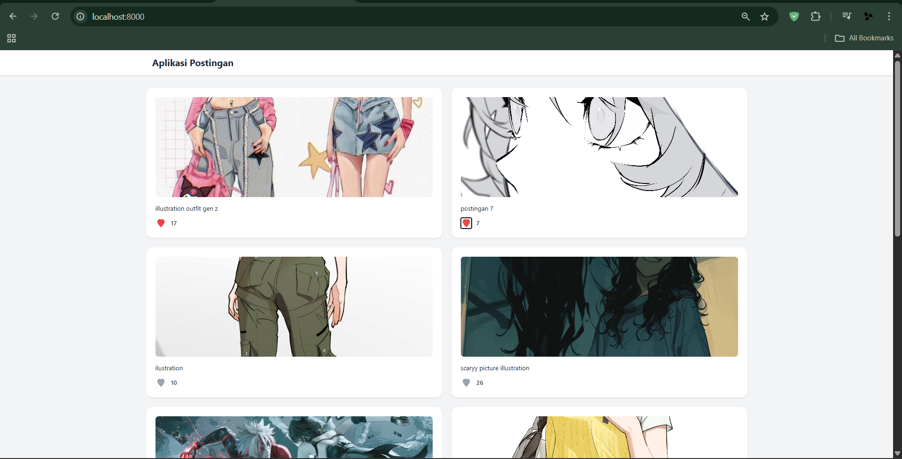
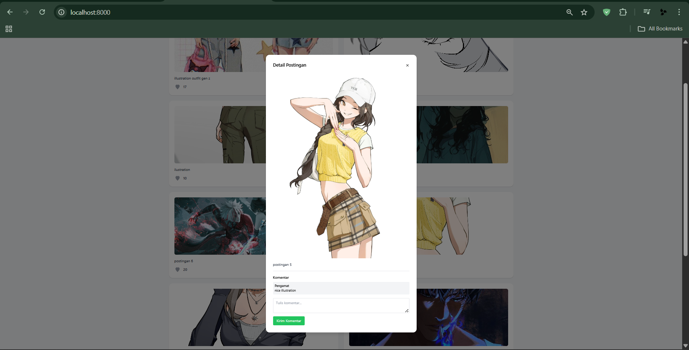
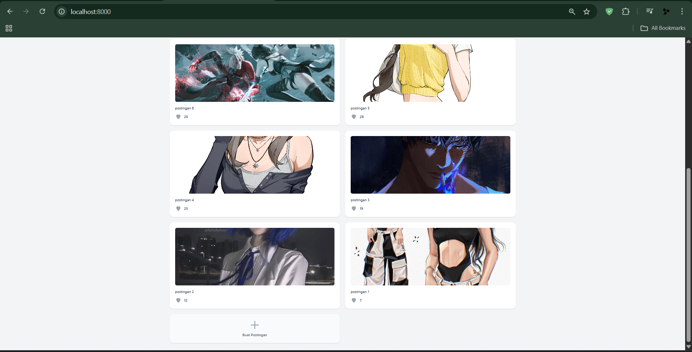
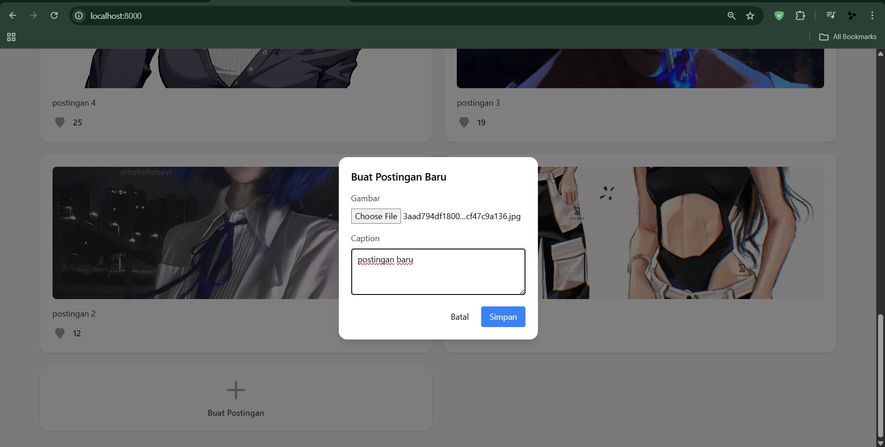
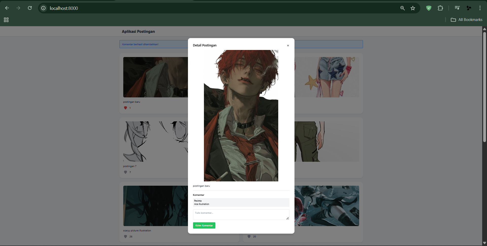

# 📝 Aplikasi Postingan Sederhana - Laravel 12

Aplikasi ini adalah proyek web sederhana menggunakan Laravel 12 yang memungkinkan pengguna untuk membuat, menyukai, dan melihat postingan. Dibuat menggunakan **Laragon versi terbaru** dan **PHP 8.2+**, aplikasi ini cocok sebagai pembelajaran dasar Laravel MVC, fitur CRUD, dan efek interaktif menggunakan JavaScript.

---

## 🖼️ Screenshots

### 🏠 Halaman Utama (Daftar Postingan)


### 🔍 Detail Postingan


### 🔻 Bagian Bawah


### 📝 Formulir Buat Postingan


### ✨ Postingan Baru Setelah Ditambahkan



---

## 🎯 Fitur Utama

- ✍️ Buat postingan baru
- 📃 Lihat daftar semua postingan
- ❤️ Like postingan (dengan animasi dan suara)
- 📁 Upload gambar untuk setiap postingan
- 🔒 Proteksi CSRF pada setiap request

---

## 🧰 Teknologi yang Digunakan

| Teknologi      | Versi           |
|----------------|------------------|
| Laravel        | 12.x             |
| PHP            | 8.2+             |
| Laragon        | Terbaru (2024)   |
| Tailwind CSS   | CDN              |
| Filepond       | Untuk upload gambar |
| MySQL          | via Laragon      |
| JavaScript     | Native (vanilla) |

---

## 🚀 Instalasi dan Menjalankan Proyek

### 1. Clone Repository

```bash
git clone https://github.com/username/nama-repo.git
cd nama-repo
composer install
npm install
cp .env.example .env
php artisan key:generate
php artisan migrate
php artisan storage:link
composer run dev

